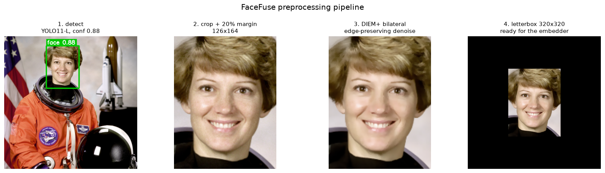
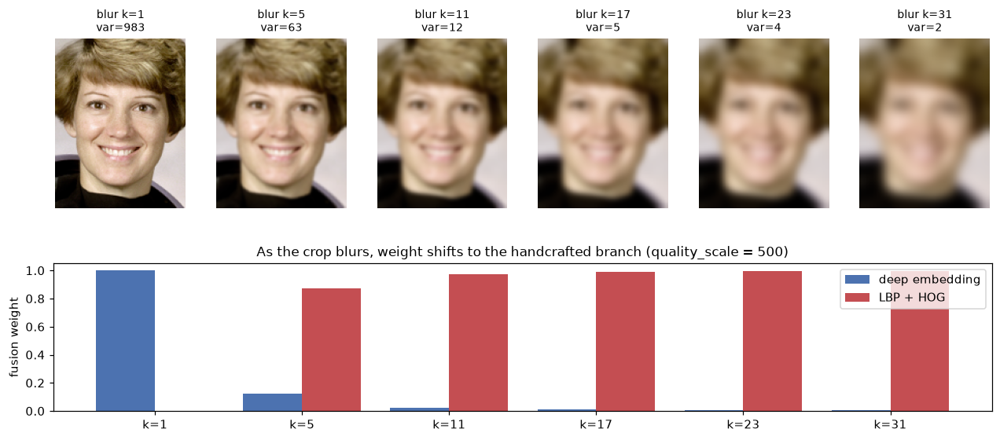
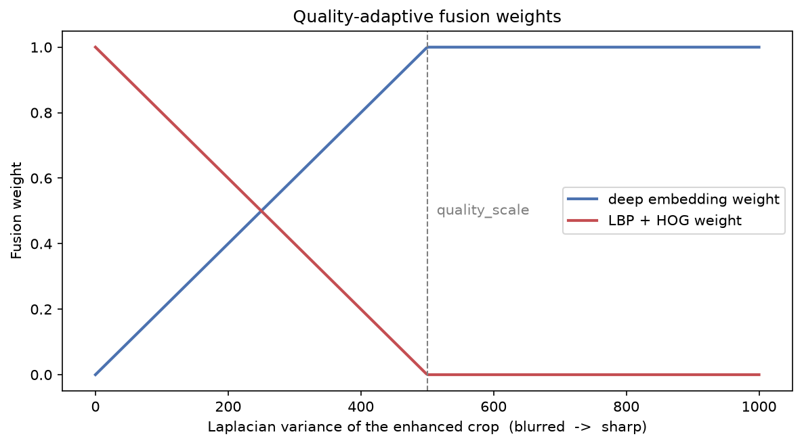
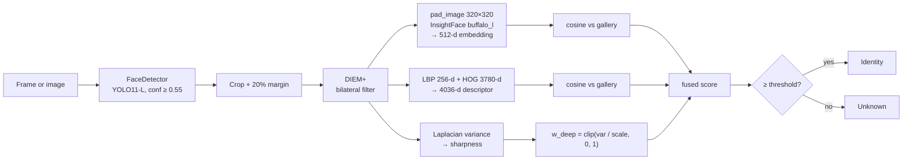
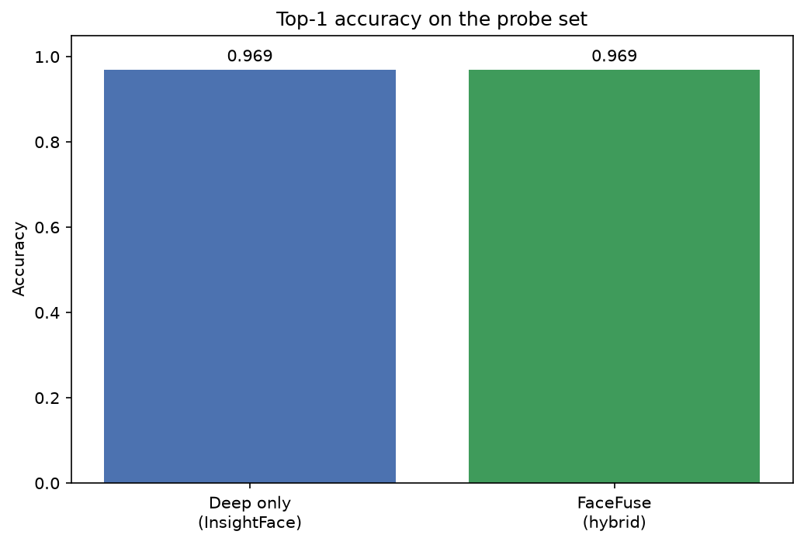
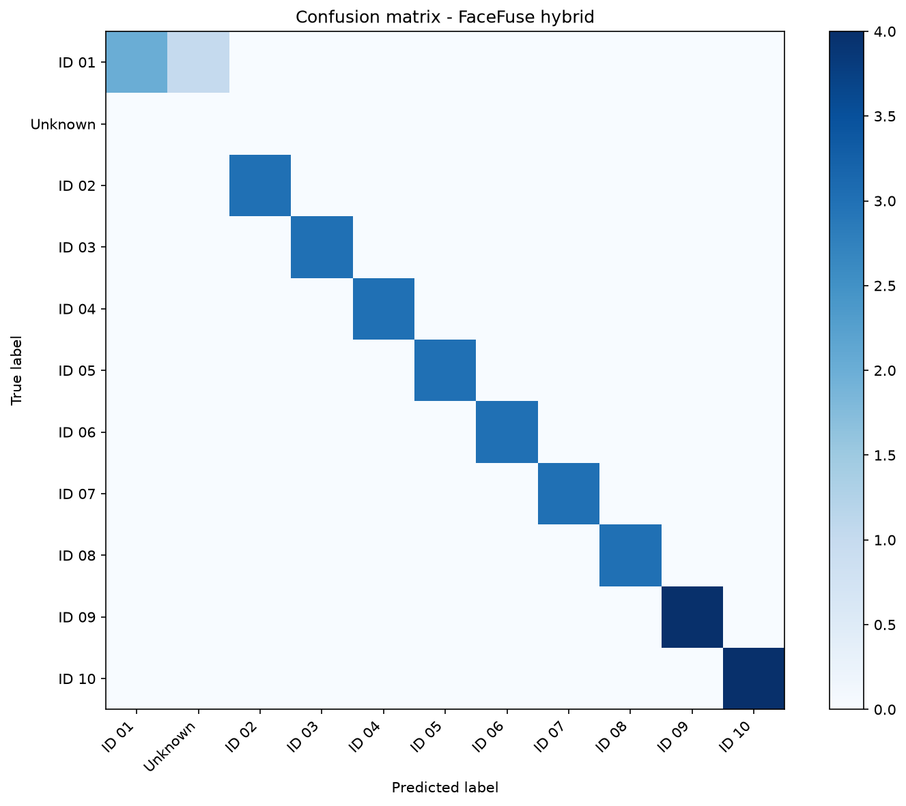

<h1 align="center">FaceFuse</h1>

<p align="center">
  <strong>Quality-adaptive hybrid face recognition</strong><br>
  YOLO11 face detection · InsightFace embeddings · LBP + HOG descriptors ·
  score-level fusion driven by image sharpness · genetic hyper-parameter search
</p>

<p align="center">
  <a href="#"></a>
  <a href="https://github.com/ahmedsayed1911/facefuse-hybrid-face-recognition/actions/workflows/ci.yml"></a>
  <a href="LICENSE"></a>
  <a href="#"></a>
  <a href="#"></a>
</p>

---

A **face recognition** pipeline that does not blindly trust its own neural
embedding. Every detected face is scored twice — once by a 512-d InsightFace
embedding, once by classical LBP + HOG texture descriptors — and the two scores
are mixed by a weight computed from how sharp the crop actually is. Sharp face,
trust the network. Blurred face, shift weight onto the illumination-invariant
handcrafted features instead of accepting a confident-but-wrong embedding.

Five parameters govern that behaviour, they interact non-linearly, and top-1
accuracy gives no gradient to follow — so a small real-valued **genetic
algorithm** searches them jointly.

## Demo

<p align="center">
  
</p>

Detection through to the tensor the embedder sees, on one image.

## The core idea

<p align="center">
  
</p>

The same face, blurred progressively. Laplacian variance falls from 983 to 2 and
the fusion weight follows it — the deep branch hands over to the handcrafted one
rather than staying confident on detail that is no longer there.

<p align="center">
  
</p>

```
w_deep = clip(laplacian_variance(crop) / quality_scale, 0, 1)
w_hand = 1 - w_deep
score  = w_deep · cosine(deep_embedding) + w_hand · cosine(lbp_hog)
```

The Laplacian variance is one convolution — negligible next to two neural
forward passes — and it fails in the same direction the embedding does. The
difference is that the embedding fails *silently*, which is the dangerous mode.
The weight makes that failure explicit and inspectable.

## How it works



Full module-by-module breakdown and the reasoning behind each choice:
**[docs/architecture.md](docs/architecture.md)**. The formal method write-up,
with the LBP/HOG/fusion equations and references: **[docs/report.md](docs/report.md)**.

## Key features

- **Two-stage detection/recognition split** — a YOLO11-L detector fine-tuned on
  WIDER FACE (single class `face`, 25.3 M parameters) localises faces; InsightFace
  only embeds the crops it is handed.
- **Score-level fusion, not feature concatenation** — the 512-d angular-margin
  embedding and the 4036-d histogram concatenation live in incomparable spaces;
  mixing the two *scalars* keeps each cosine well-behaved.
- **Quality-adaptive weighting** — a Laplacian-variance gate decides per face
  which branch to trust, with `quality_scale` setting the crossover point.
- **Vectorised LBP** — the 8-neighbour comparison runs as eight array
  operations instead of a per-pixel Python loop; a test asserts it is bit-identical
  to the scalar reference.
- **Gradient-free hyper-parameter search** — truncation selection, arithmetic
  crossover and Gaussian mutation over five bounded parameters, seeded for
  reproducibility.
- **Deep-only baseline built in** — the benchmark always runs the plain
  InsightFace path alongside the hybrid one, so the fusion has to earn its place.
- **Portable by construction** — every path resolves relative to the repository
  root and is overridable by flag or environment variable; CPU and GPU are
  selected automatically.

## Install

Requires Python 3.9+.

```bash
git clone https://github.com/ahmedsayed1911/facefuse-hybrid-face-recognition.git
```

```bash
cd facefuse-hybrid-face-recognition && pip install -e .
```

Download the face-detector weights (~49 MB, attached to the release; md5 verified
on download):

```bash
python scripts/download_weights.py
```

For GPU inference also install `onnxruntime-gpu`:

```bash
pip install -e ".[gpu]"
```

The InsightFace `buffalo_l` model pack (~300 MB) downloads itself into
`~/.insightface/` the first time a recogniser is constructed.

## Quick start

**1. Check the detector on any photo — no gallery needed:**

```bash
facefuse annotate photo.jpg --detect-only
```

Writes `outputs/photo_annotated.jpg` with a box and confidence per face.

**2. Enrol some identities.** One folder per person, folder name is the label:

```
data/gallery/Ada Lovelace/01.jpg, 02.jpg, 03.jpg
data/probe/Ada Lovelace/04.jpg
```

Details, and what makes a good gallery, in
**[docs/dataset.md](docs/dataset.md)**.

**3. Recognise:**

```bash
facefuse annotate group_photo.jpg
```

```text
Detected 3 face(s) in group_photo.jpg
  Ada Lovelace         score=0.741  lap_var=  612.4  w_deep=1.00
  Alan Turing          score=0.688  lap_var=  118.9  w_deep=0.24
  Unknown              score=0.312  lap_var=  455.1  w_deep=0.91
Wrote outputs/group_photo_annotated.jpg
```

**4. Live from a webcam:**

```bash
facefuse webcam
```

**5. Full benchmark — enrol, search parameters, evaluate against the baseline:**

```bash
facefuse benchmark --no-show
```

Writes `outputs/accuracy_comparison.png`, `outputs/confusion_matrix.png`,
`outputs/quality_weighting.png` and `outputs/metrics.json`.

A narrated tour of every stage is in
**[examples/walkthrough.ipynb](examples/walkthrough.ipynb)**.

## Usage

```text
facefuse annotate  <image> [--out PATH] [--detect-only] [--threshold F] [--quality-scale F]
facefuse webcam    [--source 0|video.mp4] [--threshold F] [--quality-scale F]
facefuse benchmark [--no-optimize] [--generations N] [--population N] [--seed N] [--no-show]
```

All three accept `--weights`, `--gallery` and `--device {auto,cpu,gpu}`.
`facefuse <command> --help` prints the full list.

## Configuration

Defaults live in [`src/facefuse/config.py`](src/facefuse/config.py) and are
overridable by flag or environment variable.

| Setting | Default | Effect |
| --- | --- | --- |
| `DETECTION_CONFIDENCE` | `0.55` | YOLO confidence floor. Lower to catch small or occluded faces. |
| `DETECTION_MARGIN` | `0.20` | Box expansion. InsightFace's alignment needs context; a tight crop often yields no embedding at all. |
| `MATCH_THRESHOLD` | `0.50` | Fused score below this returns `Unknown`. |
| `QUALITY_SCALE` | `500.0` | Laplacian variance at which the deep branch reaches full weight. Lower ⇒ trust the network sooner. |
| `BILATERAL_*` | `5 / 30 / 30` | DIEM+ filter diameter, σ_color, σ_space. |
| `GA_BOUNDS` | see file | Search space for the five tuned parameters. |

| Environment variable | Overrides |
| --- | --- |
| `FACEFUSE_WEIGHTS` | detector checkpoint path |
| `FACEFUSE_GALLERY` / `FACEFUSE_PROBE` | dataset directories |
| `FACEFUSE_OUTPUT` | figure/metrics output directory |
| `FACEFUSE_EMBEDDING_MODEL` | InsightFace model pack (default `buffalo_l`) |

## Results

### Face detector

Measured during fine-tuning and read back from the shipped checkpoint —
YOLO11-L, 40 epochs, AdamW, 640 px, on the WIDER FACE validation split:

| Metric | Value |
| --- | --- |
| mAP@50 | **0.757** |
| mAP@50–95 | **0.417** |
| Precision | 0.863 |
| Recall | 0.678 |

WIDER FACE is deliberately hard — a large share of its boxes are tiny, blurred
or heavily occluded faces, which is what holds recall down.

### Recognition

Gallery of 55 images across 10 identities, 32 held-out probe images, CPU-only.

**Untuned — default parameters (`--no-optimize`). This is the number to read:**

| | Top-1 accuracy | Macro precision | Macro recall | Macro F1 | s / image |
| --- | --- | --- | --- | --- | --- |
| Deep only (InsightFace) | 0.969 | 0.909 | 0.879 | 0.891 | 1.16 |
| **FaceFuse hybrid** | 0.969 | 0.909 | 0.879 | 0.891 | 1.09 |

Two honest observations about that table.

**The fusion changed no prediction.** Almost every probe image here is a sharp,
well-lit press photograph, so the Laplacian variance sits far above
`quality_scale`, `w_deep` saturates at 1.0, and the hybrid path reduces to the
deep-only path *by construction*. The mechanism is built to matter on blurred and
low-light input, and this probe set does not contain enough of that to exercise
it. The blur sweep above shows the weights responding as designed; showing that
this improves *accuracy* needs a probe set with real degradation, which is the
first item on the roadmap.

**The single error is one probe image returning `Unknown`**, not a mistaken
identity — the correct match scored just under the 0.50 threshold.

**Tuned — after the genetic search (`--population 10 --generations 5 --seed 0`):**

| | Top-1 accuracy | Macro F1 |
| --- | --- | --- |
| Deep only (InsightFace) | 1.000 | 1.000 |
| FaceFuse hybrid | 1.000 | 1.000 |

Both reach 100%, and **this number does not mean what it looks like**. The search
found threshold = 0.370 in its first generation, which is simply low enough for
that one borderline match to clear — and it found it by maximising accuracy on
the very set it is then scored on. That is textbook test-set leakage; it is
reported here because the pipeline offers the flag, not because 100% is a result.
Fixing it properly needs a third split, which is on the roadmap.

<p align="center">
  
  
</p>

<sub>Identity labels in the published confusion matrix are anonymised; the
underlying images are not redistributable (see <a href="docs/dataset.md">docs/dataset.md</a>).</sub>

### Throughput

Roughly **0.9 images/second end-to-end on CPU** (Intel 10-core, ONNX Runtime
CPU provider) — detection, enhancement, both feature branches and an exhaustive
gallery scan. That is not interactive frame rate. No GPU measurement is included
here because none was taken on this machine; the `--device gpu` path exists and
runs, but any number for it would be a guess.

Reproduce with `facefuse benchmark --no-optimize --no-show`; the raw numbers land
in `outputs/metrics.json`.

## Project structure

```
src/facefuse/
├── config.py             # repo-relative paths, every tunable default
├── face_detection.py     # YOLO wrapper, margin cropping, letterbox padding
├── enhancement.py        # DIEM+ bilateral filter
├── recognition.py        # InsightFace embeddings, cosine matching
├── database.py           # deep-only gallery (baseline)
├── hybrid_recognition.py # LBP+HOG, quality gate, fused matcher
├── genetic_optimizer.py  # real-valued GA
├── evaluation.py         # accuracy / precision / recall / F1 / FPS
├── benchmarking.py       # hybrid vs deep-only comparison
├── visualization.py      # result figures
├── pipeline.py           # `facefuse benchmark`
├── realtime.py           # `facefuse webcam`
├── annotate.py           # `facefuse annotate`
└── cli.py                # subcommand dispatch
docs/         architecture.md, report.md, dataset.md, figures
scripts/      download_weights.py, make_demo_assets.py
examples/     walkthrough.ipynb
tests/        43 unit tests, no model weights or face images required
```

## Tech stack

| Layer | Choice |
| --- | --- |
| Detection | Ultralytics YOLO11-L fine-tuned on WIDER FACE |
| Embeddings | InsightFace `buffalo_l` (ArcFace, 512-d) via ONNX Runtime |
| Handcrafted features | Local Binary Patterns + Histogram of Oriented Gradients (OpenCV/NumPy) |
| Enhancement | OpenCV bilateral filter |
| Optimisation | custom real-valued genetic algorithm (NumPy) |
| Metrics & plots | scikit-learn, matplotlib |
| Tooling | pytest, ruff, GitHub Actions |

## Limitations

Stated plainly, because they bound what the numbers above mean:

- **The evaluation set is small.** 10 identities, 32 probe images. Percentages on
  a set this size move by 3 points per image; treat them as a smoke test, not a
  benchmark.
- **The genetic search tunes on the probe set it is scored on.** `facefuse
  benchmark` maximises probe accuracy and then reports probe accuracy, so the
  tuned figures are optimistic by construction. This is why the table above uses
  `--no-optimize`. A proper three-way gallery/validation/test split is on the
  roadmap.
- **Closed-set matching.** An unfamiliar face is rejected by a fixed cosine
  threshold, not by a calibrated open-set model. Threshold choice trades false
  accepts against false rejects with no principled operating point.
- **Exhaustive gallery scan.** Every probe is compared against every stored
  sample, so cost grows linearly with the gallery. Fine for tens of identities,
  wrong for thousands.
- **Pose.** InsightFace alignment degrades past roughly 45° of yaw and the
  gallery inherits that.
- **No anti-spoofing.** A photograph of a photograph will match. Do not use this
  for authentication.
- **The fusion benefit is unproven.** See the Results section — it is a designed
  mechanism with a passing unit test for its logic, not a measured accuracy win.

## Roadmap

- A probe set with controlled degradation (synthetic blur, low light, downscaling)
  to measure whether the fusion actually helps, and where the crossover sits.
- Separate validation and test splits so the tuned numbers mean something.
- Approximate nearest-neighbour search (FAISS) to replace the linear gallery scan.
- Face tracking across video frames instead of per-frame re-identification.
- Calibrated open-set rejection rather than a fixed cosine threshold.
- Anti-spoofing before the pipeline could be used for anything security-facing.

## Contributing

Issues and pull requests are welcome. Please run `ruff check .` and `pytest`
before opening a PR. See [CONTRIBUTING.md](CONTRIBUTING.md).

## License

Distributed under the **GNU AGPL-3.0**. This is not a free choice: FaceFuse
depends on Ultralytics YOLO and its detector is fine-tuned from an AGPL-3.0
checkpoint, so the combined work inherits that licence.

Two things to know before using this beyond research:

- **InsightFace pretrained models are licensed for non-commercial research use
  only.** This repository redistributes none of them — the package downloads them
  from upstream on first use — but that restriction still applies to you.
- **Ultralytics offers a separate commercial licence** for users who cannot
  comply with AGPL-3.0.

Full third-party attributions and dataset citations: [NOTICE](NOTICE).

No face images are distributed with this repository. See
[docs/dataset.md](docs/dataset.md) for why, and bring your own.

## Author

**Ahmed Sayed** — [@ahmedsayed1911](https://github.com/ahmedsayed1911)
